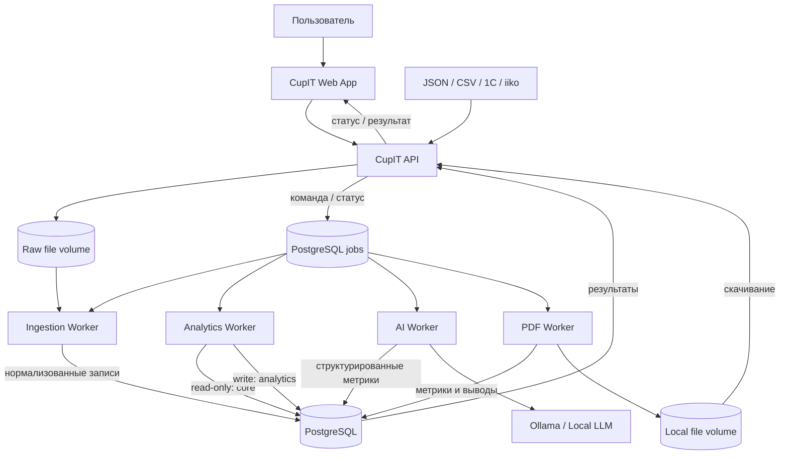

# Архитектура CupIT

Статус: проектное решение для первой рабочей версии

Источник продуктового видения: переданный файл `to_do.md`

## 1. Цель и границы

CupIT — локальная аналитическая платформа для кафе. Она импортирует данные из
учётных систем, приводит их к единой модели, рассчитывает показатели, объясняет
их с помощью локальной LLM и формирует PDF-отчёты.

Первая версия должна доказать полный поток данных:

```text
источник -> импорт -> нормализованные данные -> аналитика -> AI -> PDF/UI
```

Приоритеты архитектуры:

- данные клиента по умолчанию не покидают его инфраструктуру;
- расчёты не зависят от формата исходных файлов и конкретной POS-системы;
- LLM не получает прямого доступа к исходным данным и базе;
- каждый тяжёлый компонент можно обновлять и масштабировать отдельно;
- локальный запуск выполняется одной командой Docker Compose;
- первая версия остаётся простой: без Kubernetes, event bus и распределённых
  транзакций.

## 2. Архитектурный стиль

Проект представляет собой монорепозиторий с несколькими контейнеризованными
сервисами. У каждого сервиса отдельная точка входа, Dockerfile и ясная зона
ответственности. В первой версии сервисы используют один экземпляр PostgreSQL,
но разные логические схемы и права доступа.

Это компромисс между полностью независимыми микросервисами и модульным
монолитом: границы уже существуют, но эксплуатационная сложность остаётся
приемлемой для локальной установки.

## 3. Контейнеры и ответственность

| Компонент | Ответственность | Не должен делать |
| --- | --- | --- |
| `web` | Browser UI, dashboard и пользовательские сценарии | Парсить файлы, считать KPI, обращаться к БД/Ollama напрямую |
| `app` | Внешний HTTP API, валидация запросов, оркестрация сценариев | Парсить файлы, считать KPI, обращаться к Ollama напрямую |
| `ingestion` | Адаптеры источников, staging, проверка, нормализация, идемпотентный импорт | Считать бизнес-метрики |
| `analytics` | Расчёт KPI и сохранение версионированных результатов | Знать формат CSV, 1C или iiko |
| `ai` | Формирование безопасного контекста, вызов Ollama, рекомендации | Читать raw-файлы и транзакционные таблицы |
| `report` | Графики, шаблоны и генерация PDF из готовых результатов | Пересчитывать аналитику или вызывать LLM |
| `postgres` | Операционные данные, задания, результаты и метаданные файлов | Хранить модель Ollama и PDF как BLOB |
| `ollama` | Локальный inference выбранной модели | Получать доступ к PostgreSQL |

PDF и загруженные файлы хранятся в локальных Docker volumes. Позже этот слой
можно заменить S3-совместимым хранилищем без изменения бизнес-логики.

## 4. Схема взаимодействия



`app` создаёт команды с версионированным JSON payload в персистентной очереди.
Workers не вызывают друг друга синхронно: они забирают задания через
`SELECT ... FOR UPDATE SKIP LOCKED`, сохраняют результат и завершают статус.
Это не допускает каскадных HTTP-сбоев и сохраняет задание при перезапуске.

Для первой версии отдельный брокер сообщений не нужен. Позже реализацию очереди
можно заменить RabbitMQ/Redis Streams, сохранив payload contracts и внешний API.
HTTP используется внешним `app` и диагностическими endpoints контейнеров.

## 5. Владение данными

Один PostgreSQL разделён на схемы:

- `core` — кафе, точки, каталог, чеки и позиции чеков; запись разрешена только
  ingestion, чтение — app и analytics;
- `ingestion` — источники, партии импорта, ошибки строк и idempotency keys;
- `analytics` — запуски расчётов, агрегаты и версии алгоритмов;
- `ai` — запросы, обезличенный контекст, ответы, модель и версия prompt;
- `reporting` — задания, метаданные и путь к сформированному файлу;
- `jobs` — инфраструктурная очередь: `app` создаёт команды, workers атомарно
  захватывают их и меняют статус.

Правило: владелец бизнес-схемы — единственный её писатель. `jobs` является
инфраструктурным исключением с минимальными правами: `app` вставляет задания, а
worker может захватить и обновить только задание своего типа. Межсервисные
чтения ограничиваются стабильными SQL views. При переходе к распределённой
установке бизнес-схемы можно вынести в отдельные БД без изменения контрактов.

## 6. Доменная модель

Минимальная нормализованная модель:

- `Cafe(id, name, currency, timezone)`;
- `Location(id, cafe_id, name)`;
- `Category(id, cafe_id, name)`;
- `Product(id, cafe_id, external_id, name, category_id, active)`;
- `Receipt(id, location_id, external_id, opened_at, closed_at, status)`;
- `SaleLine(id, receipt_id, product_id, quantity, unit_price, unit_cost,
  discount, tax)`;
- `ImportSource(id, cafe_id, type, config)`;
- `ImportBatch(id, source_id, checksum, status, started_at, finished_at)`;
- `AnalyticsRun(id, cafe_id, period, algorithm_version, status, created_at)`;
- `Metric(run_id, code, dimensions, value, unit)`;
- `AiInsight(id, analytics_run_id, question, answer, model, prompt_version)`;
- `Report(id, analytics_run_id, insight_id, template_version, path, status)`.

Критичные решения модели:

- количество транзакций считается по `Receipt`, а не по строкам продаж;
- `unit_price`, `unit_cost`, скидка и налог сохраняются в `SaleLine` как снимок
  на момент продажи — изменение карточки товара не меняет историю;
- деньги хранятся как `NUMERIC`, а в Python обрабатываются через `Decimal`;
- время хранится в UTC, бизнес-группировка по дням выполняется в timezone кафе;
- записи источника имеют `external_id`, а партия — checksum/idempotency key;
  повторный импорт не создаёт дубликаты;
- удаление товара не удаляет исторические продажи: используется `active=false`.

## 7. Основные потоки

### 7.1. Импорт

1. `app` принимает файл или команду синхронизации и создаёт `ImportBatch`.
2. `ingestion` сохраняет оригинал в raw-volume и проверяет checksum.
3. Адаптер источника преобразует данные во внутренние DTO.
4. Валидатор помещает ошибочные строки в отчёт партии.
5. Валидные данные записываются атомарно в `core` через upsert.
6. Партия получает статус `completed`, `partial` или `failed`.

Адаптеры реализуют общий контракт `DataSourceAdapter`. Сначала нужен JSON
adapter; CSV, 1C и iiko добавляются отдельно и не меняют analytics.

### 7.2. Аналитика

1. `app` создаёт `AnalyticsRun` для кафе и периода.
2. Worker читает согласованный снимок нормализованных данных.
3. Чистые функции рассчитывают revenue, units, receipts, average receipt,
   gross profit, margin, показатели по дням, категориям и товарам.
4. Результаты записываются с `algorithm_version` и становятся неизменяемым
   снимком для AI, PDF и повторяемости отчётов.

### 7.3. AI-анализ

1. `app` передаёт вопрос и `analytics_run_id`.
2. `ai` загружает только разрешённые агрегаты и формирует JSON-контекст с
   лимитом размера.
3. Контекст и вопрос проходят через версионированный prompt template.
4. Ollama возвращает ответ; сервис сохраняет модель, параметры и версию prompt.
5. При недоступности Ollama задание завершается контролируемой ошибкой, а app,
   импорт и обычная аналитика продолжают работать.

### 7.4. PDF

`report` получает идентификаторы неизменяемых `AnalyticsRun` и `AiInsight`,
строит графики, рендерит версионированный шаблон, сохраняет файл в volume и
возвращает метаданные. Это гарантирует, что цифры в PDF совпадают с UI.

## 8. API первой версии

Внешний API `app`:

```text
GET  /api/v1/health
POST /api/v1/imports
GET  /api/v1/imports/{id}
POST /api/v1/analytics/runs
GET  /api/v1/analytics/runs/{id}
GET  /api/v1/dashboard?cafe_id=&from=&to=
GET  /api/v1/products/performance?cafe_id=&from=&to=
POST /api/v1/ai/insights
GET  /api/v1/ai/insights/{id}
POST /api/v1/reports
GET  /api/v1/reports/{id}
GET  /api/v1/reports/{id}/download
```

Для длительных операций `POST` возвращает `202 Accepted`, `job_id`, URL статуса
и `Retry-After`. Общий envelope ошибки:

```json
{
  "error": {
    "code": "IMPORT_VALIDATION_FAILED",
    "message": "Не удалось импортировать часть строк",
    "details": {},
    "request_id": "..."
  }
}
```

API не возвращает stack trace. На границах проверяются типы, диапазоны дат,
размер файлов, поддерживаемый формат и принадлежность сущностей одному кафе.

## 9. Структура репозитория

```text
CupIT/
├── web/                    # browser UI
├── services/
│   ├── app/
│   ├── ingestion/
│   ├── analytics/
│   ├── ai/
│   └── report/
├── packages/
│   ├── contracts/        # DTO/OpenAPI schemas, без бизнес-логики
│   └── observability/    # logging, request_id, health helpers
├── migrations/
├── data/samples/
├── infra/docker/
├── tests/
│   ├── contract/
│   ├── integration/
│   └── e2e/
├── docker-compose.yml
├── .env.example
├── ARCHITECTURE.md
└── todo.md
```

Внутри каждого Python-сервиса слои направлены внутрь:

```text
transport/API or worker -> application/use cases -> domain <- infrastructure
```

Доменная и аналитическая логика не импортирует Flask, SQLAlchemy, драйвер БД,
клиент Ollama или код другого сервиса. Инфраструктура реализует интерфейсы,
объявленные application/domain слоями.

## 10. Конфигурация и эксплуатация

Конфигурация приходит из environment variables; секреты не коммитятся.
Минимальный набор: PostgreSQL DSN, пути volumes, ограничения импорта, адрес и
модель Ollama, таймауты, уровень логирования.

Каждый контейнер предоставляет HTTP endpoint или healthcheck-команду для:

- liveness (`/health/live`) — процесс работает;
- readiness (`/health/ready`) — обязательные зависимости доступны;
- структурированные JSON-логи с `request_id`, `job_id`, `cafe_id`;
- graceful shutdown и ограниченные таймауты;
- метрики длительности, количества ошибок и размера очереди.

Резервируются PostgreSQL, raw-файлы и PDF-volume. Модель Ollama можно скачать
заново, поэтому её volume не является бизнес-бэкапом.

## 11. Надёжность и безопасность

- Все контейнеры работают не от root и имеют только нужные volumes/права БД.
- Raw-файлы считаются недоверенным вводом; задаются лимиты размера и типов.
- Для вызовов Ollama используются timeout и ограниченное число retry.
- Задания имеют состояния `queued/running/completed/failed/cancelled`, heartbeat
  и защиту от вечного `running`.
- Импорт и создание заданий поддерживают idempotency key.
- В AI-контекст не попадают персональные поля чеков и конфигурация источников.
- Позже аутентификация и роли добавляются в `app`; внутренние сервисы остаются
  недоступны с хоста и принимают трафик только из Docker network.

## 12. Проверка качества

- unit: формулы, нормализация, prompt builder, форматирование отчёта;
- contract: внешний HTTP API и версионированные payload заданий;
- integration: сервис + PostgreSQL/Ollama stub/file volume;
- end-to-end: sample JSON -> dashboard -> AI stub -> PDF;
- golden tests: неизменность метрик и ключевых страниц PDF на эталонных данных;
- migration tests: чистая БД и обновление с предыдущей версии.

## 13. Эволюция

1. Локальный MVP: один Docker Compose, JSON adapter, PostgreSQL, базовые KPI,
   Ollama и один PDF-шаблон.
2. Интеграции: CSV, 1C и iiko; расписания импорта и инкрементальная загрузка.
3. Несколько точек: `Location`, сравнение филиалов, разграничение доступа.
4. Hybrid/cloud: объектное хранилище, managed PostgreSQL, централизованный app.
5. Масштабирование: внешний job broker, отдельные БД сервисов, Kubernetes —
   только после появления подтверждённой нагрузки.

## 14. Архитектурные ограничения первой версии

В MVP не входят Kubernetes, отдельный API Gateway, event streaming, сложный
data warehouse, прогнозные ML-модели, multi-region, плагины стороннего кода и
облачная передача данных. Новые компоненты добавляются только при измеримой
необходимости.
